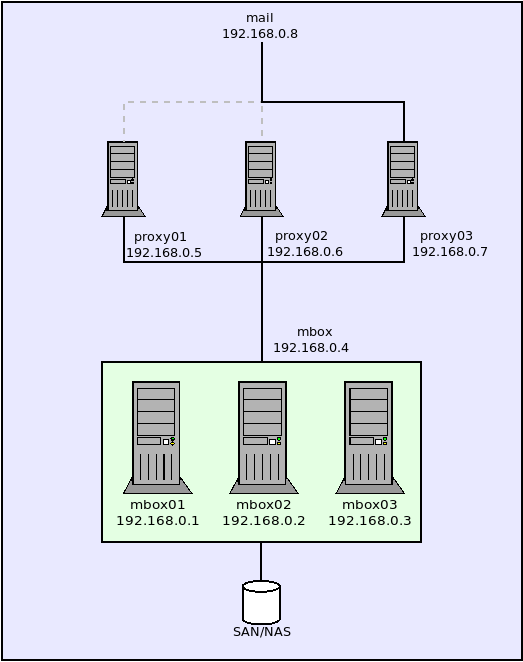

# Zimbra Community Suite Cluster with Fencing in Proxmox KVM hosts

This documentation is intended to have a full guide of how to install Zimbra (8.8.15 LTS) in a corosync/pacemaker Proxmox KVM cluster with Stonith and Fencing.


The entire schema is as following image:



This is our sample IP addeses:

```
mbox01.domain.tld  192.168.0.1
mbox02.domain.tld  192.168.0.2
mbox03.domain.tld  192.168.0.3
mbox.domain.tld    192.168.0.4  <--- mbox cluster virtual ip
proxy01.domin.tld  192.168.0.5
proxy02.domin.tld  192.168.0.6
proxy03.domin.tld  192.168.0.7
mail.domian.tld    192.168.0.8  <--- proxy round-robin virtual ip

proxmox.domain.tld 192.168.0.10 <--- Proxmox KVM host

```

## Prepare Proxmox OS

Install Fence Agents On Proxmox KVM host, this is needed to be done on the KVM hypervisor Operating System. In a root console in Proxmox host do:
```
apt install fence-agents
```

Also, you need to add a shared SAN/NAS storage resource enabled as a device for each virtual host you are going to configure as cluster. If the web UI does not let to make this, you will need to add it manually:

```
cd /etc/pve/qemu-server/
qm set 101 -ide1 /dev/sdX
```

Change "101" for the VM ID in proxmox and /dev/sdX for the SAN/NAS device you want to link to VMs.

## MBOX Cluster Virtual Machines OS Preparation

The following steps is needed to be done on all "cluster nodes", it is: mbox01, mbox02 and mbox03 hosts.

In this example all virtual hosts are a fresh-new install of CentOS 7, with only base packages. 

This are common steps needed to be executed on each node (on all of them):

```
rpm --import https://www.elrepo.org/RPM-GPG-KEY-elrepo.org
rpm -Uvh http://www.elrepo.org/elrepo-release-7.0-2.el7.elrepo.noarch.rpm
yum -y update
yum -y upgrade
```

Install needed packages in all nodes too:

```
yum -y install ipa-client unzip net-tools sysstat openssh-clients \
    perl-core libaio nmap-ncat libstdc++.so.6 wget vim \
    pacemaker pcs corosync resource-agents pacemaker-cli fence-agents-all \
    git gcc make automake autoconf libtool pexpect python-requests
```

It is important to set an FQDN hostname. In mbox01 node do:

```
hostnamectl set-hostname "mbox01.domain.tld" && exec bash 
```

In mbox02 do:

```
hostnamectl set-hostname "mbox02.domain.tld" && exec bash 
```

And in mbox03 do:

```
hostnamectl set-hostname "mbox03.domain.tld" && exec bash 
```

Next, put the propper hostnames and ip in **/etc/hosts** in all nodes, when DNS service are unavailable, this helps to keep the cluster working:

```
192.168.0.1    mbox01.domain.tld     mbox01
192.168.0.2    mbox02.domain.tld     mbox02
192.168.0.3    mbox03.domain.tld     mbox03
192.168.0.4	   mbox.domain.tld		 mbox
192.168.0.5    proxy01.domin.tld	 proxy01
192.168.0.6    proxy02.domin.tld     proxy02
192.168.0.7    proxy03.domin.tld     proxy03
192.168.0.8    mail.domian.tld       mail
192.168.0.10   proxmox.domain.tld    proxmox
```


Disable SELinux Policies in all nodes:
```
setenforce 0
```

Also disable SELinux for next reboots, changing the following line in **/etc/selinux/config** in all nodes:
```
SELINUX=permissive
```

Enable prots in Firewall:
```
firewall-cmd --permanent --add-port={25,80,110,143,389,443,465,587,993,995,5222,5223,9071,7071}/tcp
firewall-cmd --reload
```

It is possible you need some other ports, depending services you want to install. In this case you can temporary disable the firewall for testing and later decide which services you need to add. To make this in all nodes:

```
systemctl stop firewalld
systemctl disable firewalld
```

Remember later when you finnish to enable it again:
```
systemctl start firewalld
systemctl enable firewalld
```

Set the "hacluster" account password in al nodes:

```
echo "hacluster:your_password"|chpasswd
```
(change "your_password" and remember it for later)

On all nodes start cluster system service:
```
systemctl start pcsd
systemctl status pcsd
```
Corosync service has a bug in CentOS 7 which sometimes starts corosync too early when some needed system resources are not already available. To avoid this, add a 3 seconds delay before service starts, to do this, in all nodes modify **/usr/lib/systemd/system/corosync.service** file adding "**ExecStartPre=/usr/bin/sleep 3**" after "**[service]**" section. The file must be as follow on all nodes:

```
[Service]
ExecStartPre=/usr/bin/sleep 3
ExecStart=/usr/share/corosync/corosync start
ExecStop=/usr/share/corosync/corosync stop
Type=forking
...
```

And in each node reload daemons after modify this file:

```
systemctl daemon-reload
```

## Install PVE fence agent 

CentOS does not include "pve" fencing agent, so is needed to compile it. Do it in each cluster node:

```
cd
git clone https://github.com/ClusterLabs/fence-agents.git
cd fence-agents/
./autogen.sh
./configure --with-agents=pve
make && make install
fence_pve --version
```

To test it, ask fence_pve from each cluster node:
```
/usr/sbin/fence_pve --ip=<proxmox_ip> --username=root@pam --password=<proxmox_passwd> --plug=<vm_id> --action=status
```

Change <proxmox_ip> for the KVM Hypervisor address (192.168.0.10 in the example), leave "root@pam" without changes, put root Proxmox host password in <proxmox_passowrd> and set in <vm_id> the unique VM ID, for example:
```
/usr/sbin/fence_pve --ip=192.168.0.10 --username=root@pam --password="ThisIsMyPasswd" --plug=101 --action=status
```

You will get a "STATUS: OK" message if everything is ok.


## Create MBOX cluster


On any active node make auth keys share between nodes:
```
pcs cluster auth mbox01.domain.tld mbox02.domain.tld mbox03.domain.tld
```

This will ask for a user and a password. Put "**hacluster**" as user and the password you set in previous steps.


Set a name for the cluster:

```
pcs cluster setup --name cluster_cups mbox01.domain.tld mbox02.domain.tld mbox03.domain.tld
```

Start the cluster:
```
pcs cluster start --all
```

To check cluster status you can see the output of this commands:

```
pcs status cluster
corosync-cmapctl | grep members
pcs status corosync
```

Disable stonith. It is temporary, needed to configure and will be activated later:
```
pcs property set stonith-enabled=false
```

And disable the quorum policy, also later it will be activated:

```
pcs property set no-quorum-policy=ignore
pcs property
```

## Create cluster Virtual IP resource

Now, create a VIRTUAL IP resource:
```
pcs resource create virtual_ip ocf:heartbeat:IPaddr2 ip=192.168.0.4 cidr_netmask=32 nic=eth0:0 op monitor interval=30s
```

We are using "eth0" here to create "eth0:0" alias. Please verify your network interface is this or rename as needed.

Verify the creation of the virtual IP:
```
pcs status resources
```

You will get a message with a line like this:
```
virtual_ip     (ocf::heartbeat:IPaddr2):       Started mbox01.domain.tls
```

This tells cups01 host has the virtual ip assigned. you can ping and open a SSH session to verify it.


# Create ZIMBRA cluster daemon control resource

Create **/usr/lib/ocf/resource.d/heartbeat/zimbractl** file with this into it:


```bash
#!/bin/sh
#
# Resource script for Zimbra
#
# Description:  Manages Zimbra as an OCF resource in
#               an high-availability setup.
#
# Author:       RRMP <tigerlinux@gmail.com>
# License:      GNU General Public License (GPL)
#
#
#       usage: $0 {start|stop|reload|monitor|validate-all|meta-data}
#
#       The "start" arg starts a Zimbra instance
#
#       The "stop" arg stops it.
#
# OCF parameters:
#  OCF_RESKEY_binary
#  OCF_RESKEY_config_dir
#  OCF_RESKEY_parameters
#
##########################################################################

# Initialization:

: ${OCF_FUNCTIONS_DIR=${OCF_ROOT}/lib/heartbeat}
. ${OCF_FUNCTIONS_DIR}/ocf-shellfuncs

: ${OCF_RESKEY_binary="zmcontrol"}
: ${OCF_RESKEY_zimbra_dir="/opt/zimbra"}
: ${OCF_RESKEY_zimbra_user="zimbra"}
: ${OCF_RESKEY_zimbra_group="zimbra"}
USAGE="Usage: $0 {start|stop|reload|status|monitor|validate-all|meta-data}";

##########################################################################

usage() {
	echo $USAGE >&2
}

meta_data() {
	cat <<END
<?xml version="1.0"?>
<!DOCTYPE resource-agent SYSTEM "ra-api-1.dtd">
<resource-agent name="postfix">
<version>0.1</version>
<longdesc lang="en">
This script manages Zimbra as an OCF resource in a high-availability setup.
</longdesc>
<shortdesc lang="en">Manages a highly available Zimbra mail server instance</shortdesc>

<parameters>

<parameter name="binary" unique="0" required="0">
<longdesc lang="en">
Short name to the Zimbra control script.
For example, "zmcontrol" of "/etc/init.d/zimbra".
</longdesc>
<shortdesc lang="en">
Short name to the Zimbra control script</shortdesc>
<content type="string" default="zmcontrol" />
</parameter>

<parameter name="zimbra_dir" unique="1" required="0">
<longdesc lang="en">
Full path to Zimbra directory.
For example, "/opt/zimbra".
</longdesc>
<shortdesc lang="en">
Full path to Zimbra directory</shortdesc>
<content type="string" default="/opt/zimbra" />
</parameter>

<parameter name="zimbra_user" unique="1" required="0">
<longdesc lang="en">
Zimbra username.
For example, "zimbra".
</longdesc>
<shortdesc lang="en">Zimbra username</shortdesc>
<content type="string" default="zimbra" />
</parameter>

<parameter name="zimbra_group"
 unique="1" required="0">
<longdesc lang="en">
Zimbra group.
For example, "zimbra".
</longdesc>
<shortdesc lang="en">Zimbra group</shortdesc>
<content type="string" default="zimbra" />
</parameter>

</parameters>

<actions>
<action name="start"   timeout="360s" />
<action name="stop"    timeout="360s" />
<action name="reload"  timeout="360s" />
<action name="monitor" depth="0"  timeout="40s"
 interval="60s" />
<action name="validate-all"  timeout="360s" />
<action name="meta-data"  timeout="5s" />
</actions>
</resource-agent>
END
}

case $1 in
meta-data)
	meta_data
	exit $OCF_SUCCESS
	;;

usage|help)
	usage
	exit $OCF_SUCCESS
	;;
start)
	echo "Starting Zimbra Services"
	echo "0" > /var/log/db-svc-started.log
	rm -f /var/log/zimbra-svc-stopped.log
	if [ -f /etc/init.d/zimbra ]
	then
		/etc/init.d/zimbra start
	fi
	ocf_log info "Zimbra started."
	exit $OCF_SUCCESS
	;;
stop)
	echo "Stopping Zimbra Services"
	rm -f /var/log/db-svc-started.log
	echo "0" > /var/log/zimbra-svc-stopped.log
	if [ -f /etc/init.d/zimbra ]
	then
		/etc/init.d/zimbra stop
		/bin/killall -9 -u zimbra
	fi
	ocf_log info "Zimbra stopped."
	exit $OCF_SUCCESS
	;;
status|monitor)
	echo "Zimbra Services Status"
	if [ -f /var/log/zimbra-svc-started.log ]
	then
		exit $OCF_SUCCESS
	else
		exit $OCF_NOT_RUNNING
	fi
	;;
restart|reload)
	echo "Zimbra Services Restart"
	ocf_log info "Reloading Zimbra."
	if [ -f /etc/init.d/zimbra ]
	then
		/etc/init.d/zimbra stop
		/bin/killall -9 -u zimbra
		/etc/init.d/zimbra start
	fi
	exit $OCF_SUCCESS
	;;
validate-all)
	echo "Validating Zimbra"
	exit $OCF_SUCCESS
	;;
*)
	usage
	exit $OCF_ERR_UNIMPLEMENTED
	;;
esac
```

And give 755 permission:

```
chmod 755 /usr/lib/ocf/resource.d/heartbeat/zimbractl
```

Copy to the other nodes:
```
scp /usr/lib/ocf/resource.d/heartbeat/zimbractl root@mbox02.domain.tld:/usr/lib/ocf/resource.d/heartbeat/zimbractl
scp /usr/lib/ocf/resource.d/heartbeat/zimbractl root@mbox03.domain.tld:/usr/lib/ocf/resource.d/heartbeat/zimbractl
```

And in each node do:
```
chmod 755 /usr/lib/ocf/resource.d/heartbeat/zimbractl
```

Create "zimbractl" resource for Pacemaker cluster and ensure it will be present only if virtual IP is activated:
```
pcs resource create svczimbra ocf:heartbeat:zimbractl op monitor interval=30s
pcs resource op remove svczimbra monitor
pcs constraint colocation add svczimbra virtual_ip INFINITY
pcs constraint order virtual_ip then svczimbra
```

Check if it is loaded and active as a cluster resource:

```
pcs status
```


# Create shared filesystem resource

Next step makes **/opt/zimbra** a filesystem cluster resource, so it can be mounted (and umounted) only in the active cluster node. Do it in only one online cluster node:

```
cd /
pcs cluster cib add_fs
pcs -f add_fs resource create zimbra_fs Filesystem device="/dev/sdX" directory="/opt/zimbra" fstype="ext4"
pcs -f add_fs constraint colocation add svczimbra zimbra_fs INFINITY
pcs -f add_fs constraint order zimbra_fs then svczimbra
pcs cluster cib-push add_fs
```

And on each node enable services:

```
systemctl enable pcsd
systemctl enable corosync
systemctl enable pacemaker
```

## Installing Zimbra

Zimbra Community Suite is not intended to work as a cluster. There is no any official documentation with guidelines to do that. So, we need to make a hack: we are going to install ZCS as usually, in the normal way in the first cluster node. It will set the Operating Systen environment (users, permissions, etc) and in /opt/zimbra will be all services files. Well... in the other two nodes we will make the same, but ignoring all /opt/zimbra stuff, because we will use only first one (using SAN/NAS storage)


It is needed to make temporary the address resolution of "**mail.domain.tld**" to point to this server, so change /etc/hosts line to:


```
127.0.0.1	mail.domain.tld mail 
```

And remember having /opt/zimbra as a mountpoint to your NAS or SAN storage:

Download and Install the Software:

```
mkdir /root/zimbra && cd /root/zimbra
wget https://files.zimbra.com/downloads/8.8.15_GA/zcs-8.8.15_GA_3869.RHEL7_64.20190918004220.tgz
tar zxpf zcs-8.8.15_GA_3869.RHEL7_64.20190918004220.tgz
cd zcs-8.8.15_GA_3869.RHEL7_64.20190918004220
./install.sh -s
```
Note "-s" option: it will install the software without configure it. We will make it later.

The instaler will ask you several questions, choose the following options:

```
  Do you agree with the terms of the software license agreement? [N] y
  Use Zimbra's package repository [Y]
  Install zimbra-ldap [Y] 
  Install zimbra-logger [Y] 
  Install zimbra-mta [Y] 
  Install zimbra-dnscache [Y] 
  Install zimbra-snmp [Y] 
  Install zimbra-store [Y] 
  Install zimbra-apache [Y] 
  Install zimbra-spell [Y] 
  Install zimbra-memcached [Y] 
  Install zimbra-proxy [Y] 
  Install zimbra-drive [N] 
  Install zimbra-imapd (BETA - for evaluation only) [N]     <--- press ENTER
  Install zimbra-chat [Y]
  The system will be modified.  Continue? [N] Y
```

Zimbra will download updates and pathces, go for a coffe, because it is Java and all Java stuff always delays a lot, even running simple procecess.


Fix CA paths:

```
mkdir -p /opt/zimbra/java/jre/lib/security/
ln -s /opt/zimbra/common/etc/java/cacerts /opt/zimbra/java/jre/lib/security/cacerts
chown -R  zimbra.zimbra /opt/zimbra/java
```


Then run the installer configuration:

```
/opt/zimbra/libexec/zmsetup.pl
```

You may get an error message like this, informing your about resolving MX record, so you will need to change it an give the right domain name. Rememeber MX record points to mail.domain.tld and not zimbra01.domain.tld:

```
DNS ERROR resolving MX for zimbra01.domain.tld
It is suggested that the domain name have an MX record configured in DNS
Change domain name? [Yes] <---- press ENTER
Create domain: [zimbra01.domain.tld] domain.tld <----- your MX host here
```

Set Zimbra Admin Password:

When prompt shows text **"Address unconfigured (++) items (? - help)"** press 7 **zimbra-store** and ENTER, then 4 **Admin Password** and ENTER

After it press ENTER in "Select, or 'r' for previous menu [r]" prompt message to go to main menu

Set Domain in LDAP:

If you skip this step, your domain name will be "zimbra01.domain.tld" so mailboxes will have addresses like "user@zimbra01.domain.tld" and you maybe preffer to have "user@domain.tld" mail accounts instead, so change the default config:

Go to option 2 **"zimbra-ldap"** and then option 3 **"Domain to create"** and verify if it needed to change default domain to "domain.tld" (or if already configured, it depends on your DNS)

Install Zimbra server:

When you have set it, return to main menu pressing ENTER in "Select, or 'r' for previous menu [r]" prompt message.

```
  Select from menu, or press 'a' to apply config (? - help) a
  Save configuration data to a file? [Yes]
  Save config in file: [/opt/zimbra/config.21593]
  The system will be modified - continue? [No] Yes
```

Zimbra will start to install, go for another coffe, Java presents it:

```
  Notify Zimbra of your installation? [Yes]
  Configuration complete - press return to exit
```

Now, copy the created config file to the other node:

scp /opt/zimbra/config.21593 zimbra02.domain.tld:/root/zmconfig.log


Now, delete "**mail.domain.tld**" line in /etc/hosts

## Install the mbox02 and mbox03 nodes

**WARNING:** This procedure MUST be done with mbox02 and mbox03 in **OFFLINE** mode in cluster. This can be done stopping all cluster services in zimbra02:

```
pcs cluster stop mbox02.domain.tld
pcs cluster stop mbox03.domain.tld
```

Now, in each node, if you do:

```
pcs status
```

You will get a message like this:

```
Error: cluster is not currently running on this node
```

In the **offline** nodes (mbox02 and mbox03) It is needed again to put "mail.domain.tld" in /etc/hosts, as we do in first server, after this install in the same way:

```
mkdir /opt/zimbra
mkdir /root/zimbra && cd /root/zimbra
wget https://files.zimbra.com/downloads/8.8.15_GA/zcs-8.8.15_GA_3869.RHEL7_64.20190918004220.tgz
tar zxpf zcs-8.8.15_GA_3869.RHEL7_64.20190918004220.tgz
cd zcs-8.8.15_GA_3869.RHEL7_64.20190918004220
./install.sh -s
```

Follow the instaler questions with the same options, make sure they are the same:

```
  Do you agree with the terms of the software license agreement? [N] y
  Use Zimbra's package repository [Y]
  Install zimbra-ldap [Y] 
  Install zimbra-logger [Y] 
  Install zimbra-mta [Y] 
  Install zimbra-dnscache [Y] 
  Install zimbra-snmp [Y] 
  Install zimbra-store [Y] 
  Install zimbra-apache [Y] 
  Install zimbra-spell [Y] 
  Install zimbra-memcached [Y] 
  Install zimbra-proxy [Y] 
  Install zimbra-drive [N] 
  Install zimbra-imapd (BETA - for evaluation only) [N]     <--- press ENTER
  Install zimbra-chat [Y] 
  The system will be modified.  Continue? [N] Y
```

Cofee time (well... maybe it will be no good for health, tea will aso works).

When it finishes:

```
mkdir -p /opt/zimbra/java/jre/lib/security/
ln -s /opt/zimbra/common/etc/java/cacerts /opt/zimbra/java/jre/lib/security/cacerts
chown -R  zimbra.zimbra /opt/zimbra/java
```

And now, use the same config file (the file you copies by SCP in previous steps)

```
/opt/zimbra/libexec/zmsetup.pl -c /root/zmconfig.log
```

After it, stop zimbra services and get rid of all files created by the installer:
```
/etc/init.d/zimbra stop
killall -9 -u zimbra
mv /opt/zimbra /root/old-zimbra
mkdir /opt/zimbra
```

And delete the /etc/hosts line with "**mail.domain.tld**" definition

Now, restore cluster in zimbra02:

```
pcs cluster start mbox02.domain.tld
```

So far, we have configured Zimbra to work as a active-passive cluster. It can be probed opening https://mail.domain.tld, stoping (or shutting down) mbox01 will pass all services to mbox02 or mbx03 (waiting for stoping and starting, tea on hand) and viceversa. You can watch the process of passing one node to another with:

```
watch pcs status
```

(CONTOL + C to exit)


# Set LDAP Auto-Provission:

This step is required to have all external LDAP accounts available in Zimbra MailBox. In this example we use a FreeIPA server, but any LDAP can do this job, as well you know some important configuration fields:

- The URL of the LDAP, in this example **ldap://freeipa.domain.tld:389**
- The LDAP Search Base where accounts data can be found. In this example **cn=accounts,dc=domain,dc=tld**
- The filter for finding the account. It is important to ensure the expresion filter to provide only one result. in this example **(uid=%u)**

So, Open **https://mail.domain.tld:7071** to get into Zimbra Admin Interface. then go to **Admin > Configuration > Domain**, click in **domain.tld** in domain list. Go to **Authentication** in the left menu and click on the **gear icon** on the top right corner and select **Autentication**. Now follow the dialogs, giving the following answers:

- **Use external LDAP** (click "next")
- Put the LDAP (FreeIPA) hostname or IP: **freeipa.domain.tld**
- Put **(uid=%u)** into Filter Option (remember it works in FreeIPA, modify it to fit your LDAP tree)
- Put **cn=users,cn=accounts,dc=domain,dc=tld** on Base DN (idem: change domain components to fit yours)
- **Next**
- Optionally put DN variables if you have configured it in your LDAP server
- Test your LDAP connection using a existing user/password account in your LDAP
- **Finnish** the auth config dialog

Now, open a root shell in Zimbra server and write next commands:

```
su - zimbra
zmprov md prue.ba +zimbraAutoProvAttrMap description=description
zmprov md prue.ba +zimbraAutoProvAttrMap displayName=displayName
zmprov md prue.ba +zimbraAutoProvAttrMap givenName=givenName
zmprov md prue.ba +zimbraAutoProvAttrMap cn=cn
zmprov md prue.ba +zimbraAutoProvAttrMap sn=sn
zmprov md prue.ba zimbraAutoProvAuthMech LDAP
zmprov md prue.ba zimbraAutoProvLdapSearchBase "cn=accounts,dc=domain,dc=tld"
zmprov md prue.ba zimbraAutoProvLdapSearchFilter "(uid=%u)"
zmprov md prue.ba zimbraAutoProvLdapURL "ldap://freeipa.domain.tld:389"
zmprov md prue.ba zimbraAutoProvMode LAZY
zmprov md prue.ba zimbraAutoProvNotificationBody "Your account has been auto provisioned.  Your email address is ${ACCOUNT_ADDRESS}."
zmprov md prue.ba zimbraAutoProvNotificationFromAddress prov-admin@prue.ba
zmprov md prue.ba zimbraAutoProvNotificationSubject "New account auto provisioned"
```
Remember to change "cn=accounts,dc=domain,dc=tld", (uid=%u)" and "ldap://freeipa.domain.tld:389" accornding to your needs, and put exactly the same you give in dialog wizard.

You have now configured a Zimbra Server with external LDAP accounts. Cheers.

## Configure Fencing resources

When a node fails (loose connection, hangs, crash, etc) pacemaker needs to fence it. In the following example is created a stonith rule for each node, calling Proxmox KVM system to make actions over any failing virtual machine:


On any active node make the stonith rules for each one:

```
pcs stonith create fence_mboxs01 fence_pve ipaddr=<proxmox_ip> inet4_only="true" vmtype="qemu" \
  login="root@pam" passwd=<proxmox_passwd> delay="15" port=<vm_id> pcmk_host_check=static-list \
  pcmk_host_list="mbox01.domain.tld" node_name="pve"

pcs stonith create fence_mbox02 fence_pve ipaddr=<proxmox_ip> inet4_only="true" vmtype="qemu" \
  login="root@pam" passwd=<proxmox_passwd> delay="15" port=<vm_id> pcmk_host_check=static-list \
  pcmk_host_list="mbox02.domain.tld" node_name="pve"

pcs stonith create fence_mbox03 fence_pve ipaddr=<proxmox_ip> inet4_only="true" vmtype="qemu" \
  login="root@pam" passwd=<proxmox_passwd> delay="15" port=<vm_id> pcmk_host_check=static-list \
  pcmk_host_list="mbox03.domain.tld" node_name="pve"
```

Next, set the stonith resource to be (when possible) active in its own node. This is optional, but allows a node to call its hypervisor to shut it down, there are environments (a proxmox cluster where VM can be running in different hosts) where this si the most secure configuration to ensure sucessful stonith:
```
pcs constraint location fence_mbox01 prefers mbox01.domain.tld
pcs constraint location fence_mbox02 prefers mbox02.domain.tld
pcs constraint location fence_mbox03 prefers mbox03.domain.tld
```

For a node to be online it must see at least one more node, it is, needs a quorum > 1. Enable stonith in cluster, set a shut down action when quorum is not satisfied:

```
pcs property set stonith-enabled=true
pcs property set no-quorum-policy=suicide
pcs stonith update fence_mbox01 action="off" --force
pcs stonith update fence_mbox02 action="off" --force
pcs stonith update fence_mbox03 action="off" --force
```

Resources and stonith actions are now completely configured. Restart all cluster services in all nodes (execute the following in each one):
```
systemctl enable pcsd
systemctl enable corosync
systemctl enable pacemaker
```

Now, test the cluster fencing, disconecting one node, turning off the network interface:

```
systemctl stop networking
```

Check the cluster status, when this node loose comunication with the cluster, the fencing agent will send a signal to VM hypervisor and a STOINITH will be done over this absent node. You can watch the process seeing happening changes:

```
watch pcs status
```
(CONTROL-C to exit)


## Install Zimbra Proxy Servers

First, set FQDN hostname for each node, i.e:

```
hostnamectl set-hostname "proxy01.domain.tld" && exec bash 
```

Next, verify the propper hostname and ip in /etc/hosts as well as others nodes:

```
192.168.0.1    mbox01.domain.tld     mbox01
192.168.0.2    mbox02.domain.tld     mbox02
192.168.0.3    mbox03.domain.tld     mbox03
192.168.0.4    mbox.domain.tld       mbox
192.168.0.5    proxy01.domin.tld     proxy01
192.168.0.6    proxy02.domin.tld     proxy02
192.168.0.7    proxy03.domin.tld     proxy03
192.168.0.8    mail.domian.tld       mail
192.168.0.10   proxmox.domain.tld    proxmox
```

If you are using FreeIPA as LDAP external service, it is necessary to install the IPA agent and enroll the system:

```
ipa-client-install --enable-dns-updates
```

Otherwise, insert the propper DNS record to solve "proxy01.domain.tld"


Disable SELinux Policies in all systems:

First, disable SELinux in the current running system:

```
setenforce 0
```

Then, disable it in the next boot, changing the following line in /etc/selinux/config
```
SELINUX=permissive
```

Now run the installer (with -s option) and ONLY select zimbra-proxy option:

```
./install.sh -s

Do you agree with the terms of the software license agreement? [N] Y
Use Zimbra's package repository [Y]
Install zimbra-ldap [Y] N
Install zimbra-logger [Y] N
Install zimbra-mta [Y] N
Install zimbra-dnscache [N] N
Install zimbra-snmp [Y] N
Install zimbra-store [Y] N
Install zimbra-apache [Y] N
Install zimbra-spell [Y] N
Install zimbra-memcached [Y] N
Install zimbra-proxy [Y] Y <----------------- "y" option only on this

The system will be modified.  Continue? [N] Y
```

In many recipes and howtos zimbra-memcached is installed with zimbra-proxy, but the truth is there is only one ziimbra-memcached needed for zimbra services to work and in all tests, only zimbra-proxy package selected gives the expected behavior. Besides the installer will download and install zimbra-memcached, only the mailboxes servers will attend tho this services requests.

Wait for the install process (lemonade maybe?) ant when it finnishes run:

```
mkdir -p /opt/zimbra/java/jre/lib/security/
ln -s /opt/zimbra/common/etc/java/cacerts /opt/zimbra/java/jre/lib/security/cacerts
chown -R  zimbra.zimbra /opt/zimbra/java
/opt/zimbra/libexec/zmsetup.pl
```

You will need to know the "LDAP Nginx Password" for continue. Go to mailbox server (zimbra01 or zimbra02, the one is alive and as master node in cluster) and run:

```
su - zimbra
zmlocalconfig -s ldap_nginx_password
```

Now in proxy installer menu, go to Option 1 "Common Configuration" and choose the option 2 "**Ldap master host**". Put here the virtual IP hostname: "**mail.domain.tld**"

Then choose option 4 "Ldap Admin password" and put the one you get from mailboxes servers. When set, it will automaticly connect and retrieve all zimbra services configuration via LDAP:

```
Setting defaults from ldap...done.
```

Now, go to main menu pressing ENTER in "Select, or 'r' for previous menu [r]" prompt message, and go to option 2 "zimbra-proxy", then option 12 "Bind password for nginx ldap user" and put the same you get from "zmlocalconfig -s ldap_nginx_password" in mailbox server.

Once this password is set, return to main menu and finnish the configuration:

```
*** CONFIGURATION COMPLETE - press 'a' to apply
Select from menu, or press 'a' to apply config (? - help) a  <------ press "a" and ENTER here
Save configuration data to a file? [Yes]
Save config in file: [/opt/zimbra/config.15941] 
Saving config in /opt/zimbra/config.15941...done.
The system will be modified - continue? [No] Yes <---- "Yes" and ENTER
...
Notify Zimbra of your installation? [Yes]
...
Configuration complete - press return to exit 
```

To make all this completed, it is needed to update SSH keys between servers, so in mailbox server (zimbra01 or zimbra02, the one serving as master) and in proxy01 server do:

```
su - zimbra
/opt/zimbra/bin/zmsshkeygen
/opt/zimbra/bin/zmupdateauthkeys
exit;
```

Then, when done, in both servers do also:
```
/opt/zimbra/libexec/zmsyslogsetup
```

Now go to /etc/rsyslog.conf in all hosts (mailboxes and proxies) and comment out all lines with "@mail.domain.tld" and remove/comment the ones to point lo local files, so it has to be like this (in all servers!):

```
local0.*                @mail.prue.ba
local1.*                @mail.prue.ba
auth.*                  @mail.prue.ba
mail.*                  @mail.prue.ba
# local0.*                -/var/log/zimbra.log
# local1.*                -/var/log/zimbra-stats.log
# auth.*                  -/var/log/zimbra.log
```

This is a bug fix: all logs comes in a loop when the server sends their messages "remotely to himself". If you skip this step, you will go empty of space in local disk as soon as the filesystem speed allows it.


## Links (consulted documentation):

- https://www.alteeve.com/w/Fencing_KVM_Virtual_Servers
- https://access.redhat.com/solutions/293183
- https://clusterlabs.org/pacemaker/doc/en-US/Pacemaker/1.1/html/Clusters_from_Scratch/_configure_the_cluster_for_stonith.html
- Proxmox: servicio fence_virtd https://www.lisenet.com/2018/libvirt-fencing-on-a-physical-kvm-host/
- Proxmox: agente fence_virsh https://linux.die.net/man/8/fence_virsh
- CentOS VMs: agente fence_xvm https://www.alteeve.com/w/Fencing_KVM_Virtual_Servers
- KVM fencing: https://www.alteeve.com/w/Fencing_KVM_Virtual_Servers
- Fencing Pacemaker: https://www.unixarena.com/2016/01/rhel-7-configure-fencing-pacemaker.html/
- How to configure Red Hat Cluster with fencing of two KVM guests running on two different KVM hosts https://access.redhat.com/solutions/293183 
- https://icicimov.github.io/blog/virtualization/Pacemaker-VM-cluster-fencing-in-Proxmox-with-fence-pve/
- https://www.lisenet.com/2018/libvirt-fencing-on-a-physical-kvm-host/
- https://www.epilis.gr/en/blog/2018/07/02/fencing-linux-vm-cluster/
- https://clusterlabs.org/pacemaker/doc/en-US/Pacemaker/1.1/html/Clusters_from_Scratch/_configure_the_cluster_for_stonith.html

## NOTES

The following command shows the quorum configuration.
```
pcs quorum
pcs quorum [config]
pcs quorum expected-votes 2
```

The following command shows the quorum runtime status:
```
pcs quorum status
```

Quorum information:
```
corosync-quorumtool 
```

How to change buggy chat zimlet:

```
zmzimletctl disable com_zextras_chat_open
zmzimletctl undeploy com_zextras_chat_open
zmprov fc all
zmmailboxdctl restart
# yum install zimbra-chat
zmprov fc all
zmmailboxdctl restart
```


